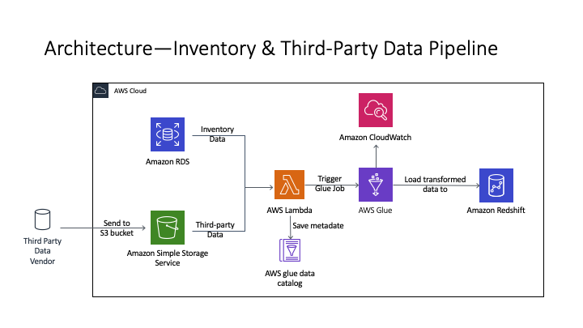
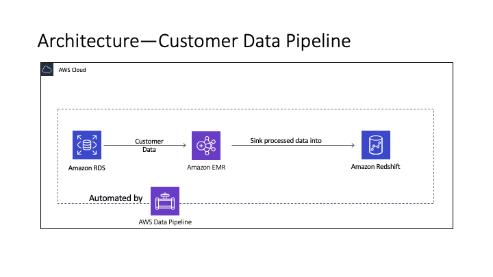
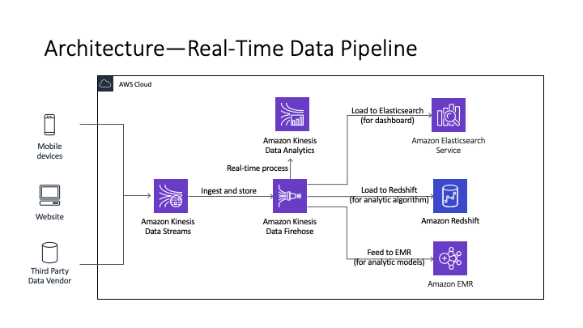

# Information Builders--Data Migration & Pipeline for Retailer
Information Builder, one of the top Big Data Integration Platforms in the industry, helps the enterprises leverage big data technologies and data science methods to drive competitive advantage on decision making and business strategies. The project is working for an apparel retailer to migrate and integrate data into decision support systems based on such as Apache Hadoop and AWS technologies. The systems provide the solution for syncing records in multiple systems, connecting data from suppliers or partners, creating marketing dashboard and near-real-time analyses so that better demonstrate daily operations and optimize future decisions. 
# Architecture
## 1. Data Pipeline for Inventory & Third-Party Data

- Three of them are built using AWS Glue, which is a serverless and fully managed ETL tool. 
One was extracting data from AWS RDS MySQL database using Glue crawler and run Glue job written in PySpark, which is triggered by a Lambda function. I generally did some transformation like changing the schema in Glue’s Schema Editor (to remove or add columns, change column names or data types), deleting null (df.na.drop(["ColumnMustNotNull"])) and duplicated values (df.dropDuplicate).  The processed table will be sent to Redshift data warehouse so that the data can be used in supply chain optimization models to better manage and organize the company’s inventory level. 
- Another two pipelines are for processing third-party data from IRI and Numerator who provided for example retail market data, point-of-sale (POS) data and ecommerce data, we analyzed those data for better understanding the market demand, the market competition and overall economic situation. The pipelines are pretty similar to previous one, but the data is from S3 bucket instead of RDS and of course, data transformation I did were also different.

## 2. Data Pipeline for Customer Data

- One of the 7 pipelines is built using AWS Data Pipeline and running processing jobs in a three-node EMR cluster with r5.xlarge (memory optimized EC2 instances) instances. The data source of this pipeline is also AWS RDS MySQL, I developed codes and run the script in EMR cluster to clean up some demographic and purchase information like age, location, ordering time, items, quantity, etc., then send the processed data into Redshift so that the data can be used to train our recommendation algorithm.

## 3. Data Pipeline for Real-Time Data

- Three of my pipelines are real-time data pipelines built based on AWS Kinesis. Those pipelines were built by me and people in my upstream data engineer team together. They were mainly responsible to grasp data from mobile devices, websites and third parties, and then passed the data to me and my team as Kinesis Stream. In other word, they took care of the producer side of the Kinesis stream, I handle three consumers to consume the data. We use those data to monitor user behavior and improve purchasing experience. For example, some of the data could be used to optimize website AI Chatbot that our program would work on text mining to extract keywords from log file then structure data and feed those data to the algorithms written by data scientists. I received the data using Kinesis Firehose then do transformations like groupBy user ID, sorted based on timestamp in the SQL editor of Kinesis Data Analytics and also transfer the data into ORC or Parquet format, which is optimal choice for storing the data in data lake or data warehouse. Then I passed the processed data using Kinesis Firehose to Redshift or Elasticsearch for my downstream data scientist team. And data scientists would read all of them directly from Firehose using 3-node EMR cluster to do further processing. I sometimes would write some scripts to support their job on EMR cluster.
